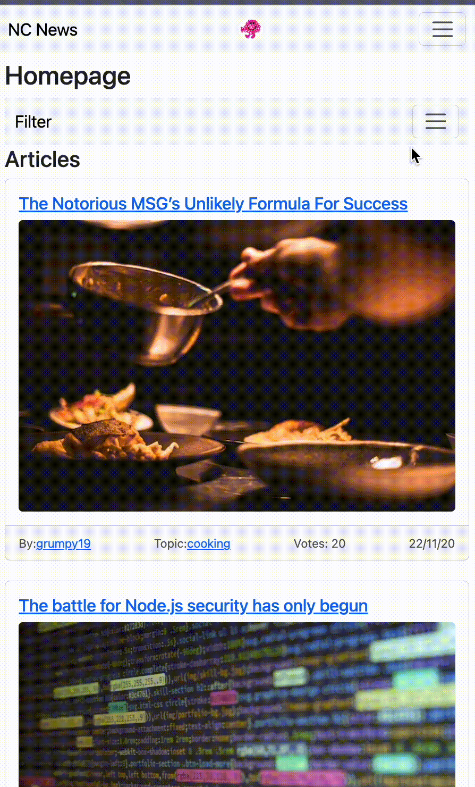
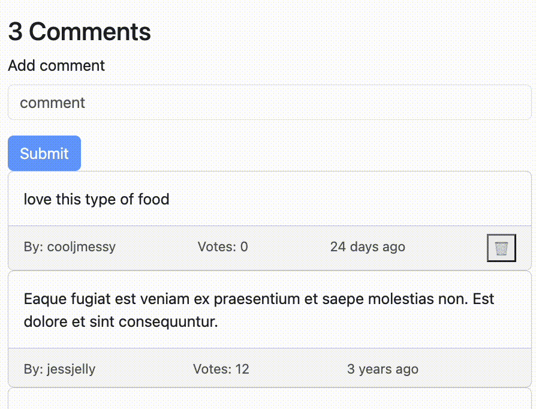

# NC NEWS - README

Welcome to NC NEWS, a mobile-first website designed for displaying and filtering through articles, with the added functionality of adding comments. This README will guide you through the project, its tech stack, and how to set it up locally.

## Live Demo

Check out the live demo of NC NEWS: [NC News Live Demo](https://deanncnews.netlify.app/) (Please note that the server may take up to 30 seconds on the initial load.)

For the backend implementation of Northcoders News, visit [NC News API](https://github.com/deankiwi/nc-news).

## Tech Stack

- **React:** A JavaScript library for building user interfaces.
- **Vite:** Used for building and deploying the project.
- **Bootstrap:** Employed for styling the website.
- **axios:** Handles data retrieval from the API.

## Prerequisites

Before getting started, ensure you have the following software installed:

- [git](https://git-scm.com/downloads)
- [node.js](https://nodejs.org/en/download)

## Setup

1. Clone the repository:

    ```bash
    git clone https://github.com/deankiwi/fe-nc-news
    ```

2. Change into the project directory:

    ```bash
    cd nc-news
    ```

3. Install dependencies:

    ```bash
    npm install
    ```

4. Run the development server:

    ```bash
    npm run dev
    ```

5. Open your browser and navigate to [http://localhost:5173/](http://localhost:5173/)

## Features

### 1. Filter Articles by Topic



Easily filter articles based on different topics to find the content that matters most to you.

### 2. Add and Remove Comments



Engage with the community by adding and removing comments on articles, fostering discussions and interactions.

### 3. Like/Dislike Articles


Express your opinion on articles by liking or disliking them, influencing the popularity of content.

## Contribution

Feel free to contribute to the project by opening issues or submitting pull requests. Your feedback and contributions are highly appreciated!

Thank you for using NC NEWS! If you encounter any issues or have suggestions for improvement, please don't hesitate to get in touch. Happy coding!
